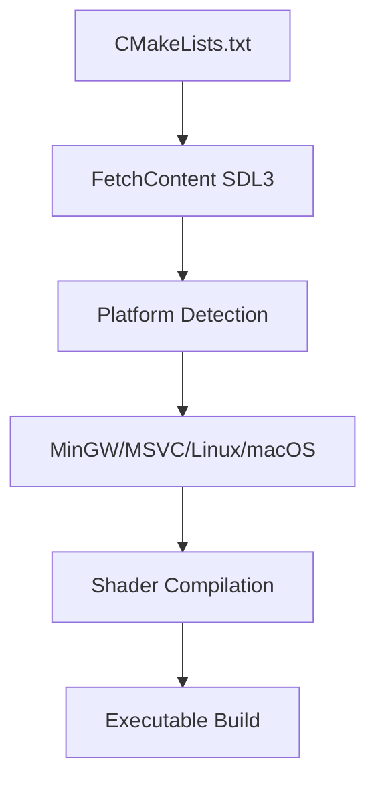

# SDL3 GPU MVP Design Document

## Project Overview
A minimum viable example demonstrating SDL3 GPU API with:
- SDL2-style event loop
- Textured triangle rendering with tint uniform
- Dynamic vertex buffer (CPU-allocated, GPU-updated per frame)
- Static index buffer (GPU-allocated)
- Cross-platform support (MinGW, MSVC, Linux, macOS)

## Architecture

### 1. Build System


### 2. Application Structure


## Key Technical Decisions

### 1. Shader Strategy
SDL3 GPU uses SPIR-V internally but accepts different source formats:
- **Option A**: Precompile shaders to SPIR-V/DXBC/MSL offline
- **Option B**: Use SDL_ShaderCross (recommended for portability)
- **Option C**: Inline HLSL/GLSL with runtime compilation (development only)

**Chosen**: Option B - SDL_ShaderCross for maximum portability without precompilation complexity

### 2. Buffer Management
| Buffer | Location | Usage | Update Strategy |
|--------|----------|-------|-----------------|
| Index Buffer | GPU | Static | Created once, never updated |
| Vertex Buffer | CPU -> GPU | Dynamic | Mapped per frame, uploaded via copy pass |
| Uniform Buffer | CPU -> GPU | Per-frame | Push constants or small buffer update |

### 3. Cross-Platform Considerations
- **Windows (MSVC)**: Standard CMake, SDL3.dll
- **Windows (MinGW)**: Cross-compilation friendly, static linking option
- **Linux**: pkg-config for system libraries
- **macOS**: Framework handling, Metal backend

### 4. Vertex Layout
```cpp
struct Vertex {
    float position[2];  // SDL_GPUVertexAttribute
    float texcoord[2];  // SDL_GPUVertexAttribute
};
```

### 5. Uniform Layout
```cpp
struct TintUniform {
    float tintColor[4];  // RGBA tint that drifts over time
};
```

## File Structure
```
SDL3_MVP/
├── CMakeLists.txt          # Root CMake with FetchContent
├── shaders/
│   ├── triangle.vert       # Vertex shader (HLSL/GLSL)
│   └── triangle.frag       # Fragment shader with tint
├── assets/
│   └── placeholder.bmp     # Will be replaced with user texture
└── src/
    └── main.cpp            # Main application
```

## Implementation Notes

### SDL3 GPU Pipeline Setup
1. Create [`SDL_GPUDevice`](src/main.cpp) with [`SDL_CreateGPUDevice()`](src/main.cpp)
2. Create swapchain with [`SDL_CreateGPUSwapchain()`](src/main.cpp) or [`SDL_ClaimWindowForGPUDevice()`](src/main.cpp)
3. Load shaders via [`SDL_ShaderCross`](src/main.cpp) or compile inline
4. Create pipeline with:
   - [`SDL_GPUGraphicsPipelineCreateInfo`](src/main.cpp)
   - Vertex input format description
   - Blend state for texture + tint mixing
5. Create buffers with [`SDL_CreateGPUBuffer()`](src/main.cpp)

### Per-Frame Update Flow
1. Map vertex buffer via [`SDL_MapGPUTransferBuffer()`](src/main.cpp) or CPU-side staging
2. Update vertex data (e.g., subtle animation)
3. Create/upload via copy command buffer
4. Update tint uniform (color drifting logic)
5. Record render pass
6. Submit and present

### Color Drift Logic
Drifts between **Blue** (0.0, 0.4, 0.8, 1.0) and **Orange** (1.0, 0.5, 0.0, 1.0):
```cpp
// Smooth oscillation between blue and orange using sin
float t = (sin(currentTime) + 1.0f) * 0.5f;  // 0 to 1
static constexpr Color BLUE{0.0f, 0.4f, 0.8f, 1.0f};
static constexpr Color ORANGE{1.0f, 0.5f, 0.0f, 1.0f};
tint.r = lerp(BLUE.r, ORANGE.r, t);
tint.g = lerp(BLUE.g, ORANGE.g, t);
tint.b = lerp(BLUE.b, ORANGE.b, t);
```

## Shader Implementation

### Vertex Shader (HLSL-style)
```hlsl
struct VSInput {
    float2 position : POSITION;
    float2 texcoord : TEXCOORD0;
};

struct VSOutput {
    float4 position : SV_POSITION;
    float2 texcoord : TEXCOORD0;
};

VSOutput main(VSInput input) {
    VSOutput output;
    output.position = float4(input.position, 0.0, 1.0);
    output.texcoord = input.texcoord;
    return output;
}
```

### Fragment Shader (HLSL-style)
```hlsl
cbuffer TintBuffer : register(b0) {
    float4 tintColor;
};

Texture2D texture0 : register(t0);
SamplerState sampler0 : register(s0);

float4 main(float2 texcoord : TEXCOORD0) : SV_TARGET {
    float4 texColor = texture0.Sample(sampler0, texcoord);
    return texColor * tintColor;  // Tint the texture
}
```

## Specifications
- **Texture Size**: 256x256 pixels (BMP format)
- **Tint Colors**: Blue (0.0, 0.4, 0.8) → Orange (1.0, 0.5, 0.0)
- **Triangle**: Static vertices (no animation)
- **Shaders**: Inline HLSL compiled at runtime by SDL3

## Build Commands
```bash
# Configure
cmake -B build -S . -DCMAKE_BUILD_TYPE=Release

# Build
cmake --build build --config Release

# Run
./build/SDL3_MVP
```

## Next Steps
After this plan is approved, switch to Code mode to implement:
1. CMakeLists.txt with SDL3 FetchContent
2. Shader files (HLSL for cross-compilation)
3. main.cpp with all GPU initialization and render loop
